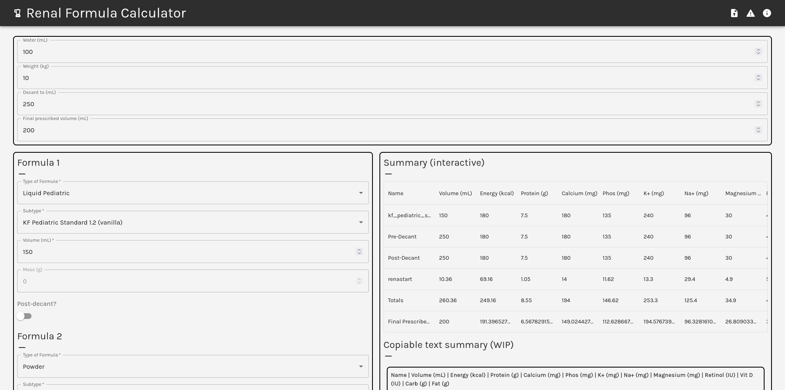

<!-- #default-branch-switch -->

# recipe

This is a self-contained React app designed to calculate the nutrition of dialysis formulae. It is meant to be used as an assistive tool in a pediatric clinical setting.



## Description

The calculation procedure preserves desired significant figures, and allows for the calculation of post-decant additives (a straightforward but error prone calculation).
In doing so, it is a less error-prone interface than traditional methods (Excel sheets) used at a local children's hospital.
The database of nutrition data can be replaced, in the event that data needs correction (or formula balances change). See `csv_to_tsdict.py` to see the generation procedure.

## Usage

#### As the repository title suggests, this is a testing/staging repository, which means the code here may be somewhat unstable.

There may be (and are) live instances of this project with slightly different datasets. Despite its experimental quality, I can say for a fact that there is at least one dietetics department which uses such a fork.

I am, unfortunately, not super aware of how licensing / copyright works, so I am not able to provide a decisive statement here on what my stance is. If you are interested in hosting a fork of this code, please contact me at `ingih2 [at] illinois [dot] edu`.

## Build Process

The project is a React app. Build and tasks are handled through `npm`.

```bash
npm install
npm start
```
If you would like to deploy to GitHub Pages, like this site, see the `deploy` task (defined in `package.json`).

## Future Updates

This was my first real foray into writing TypeScript/for web. The code is fairly stable (at least for now) -- my first priority is maintenance updates, but I'd like to gradually start improving the code quality, as appropriate.

I have come to learn recently that Create React App (which this is based on) has been deprecated for a while. Bandwidth permitting I hope to refactor this, someday?
